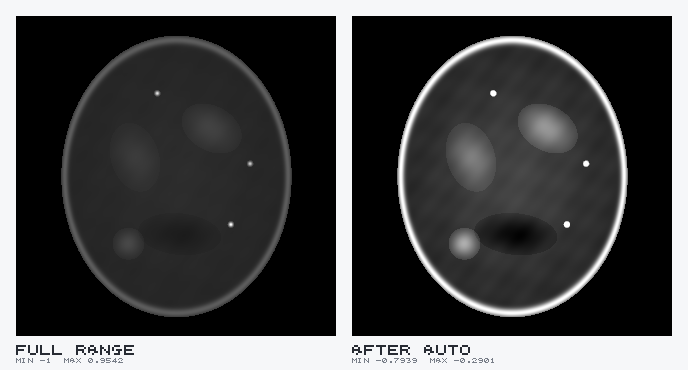

# TIFF Scientific Viewer

Preview scientific TIFF images inside VS Code — including the 32-bit float,
16-bit and signed CT/microscopy images written by `tifffile`, which VS Code's
built-in image preview and the general-purpose TIFF extensions cannot open.

The contrast model is a direct port of ImageJ's: the pixel data is never
modified, and a separate **display range** `(min, max)` is mapped to the screen.
That is the difference between a black rectangle and a readable CT slice.



*The same slice: full data range on the left, `Auto` on the right.*

## Why

A CT slice normalised to `[-1, 1]` has most of its structure packed into a
narrow band. Rendered naively across the full data range it looks almost black.
ImageJ's `Auto` finds the band; so does this.

For `sample.tif` in this repo, the data spans `[-1.0000, 0.9805]` but
`Auto` picks `[-1.0000, -0.1490]` — everything above -0.149 is bone and
saturates, and the soft tissue that occupies most of the image gets the full
256 levels. 

## Features

- **Formats**: 8/16/32/64-bit integer (signed and unsigned), float16/32/64,
  RGB and RGBA, palette; classic TIFF and BigTIFF, both byte orders.
- **Compression**: none, LZW, Deflate/ZIP, PackBits, with horizontal (2) and
  floating-point (3) predictors. Strips and tiles, chunky and planar.
- **Contrast**, ported from ImageJ:
  - `Auto` — `ContrastAdjuster.autoAdjust`, including the `pixelCount/10` rule
    that stops a constant background from swallowing the stretch, and the
    stateful threshold that tightens on each press.
  - `Enhance` — `ContrastEnhancer.stretchHistogram`, saturating 0.35% by default.
  - `Reset` — the full data range.
  - Exact numeric min/max entry, for comparing two images on one scale.
  - Min/Max/Brightness/Contrast sliders and a draggable histogram.
- **LUTs**: Grays, Inverted Grays, Fire, Ice, Spectrum, 3-3-2 RGB, Red/Green/Blue.
- **Stacks**: multi-page files get a slice slider and arrow-key navigation.
  Opening a stack windows the whole stack rather than just its first slice, and
  that range is then held as you scrub, so slices are comparable on one scale.
  Adjust it on any slice and the new range takes over; tick *Recompute range per
  slice* to have each slice window itself instead.
- **Image sequences**: select several single-slice `.tif` files in the Explorer,
  right-click, **Open as Stack** - ImageJ's *File > Import > Image Sequence*.
  Files are ordered numerically (`slice_2` before `slice_10`), the slider names
  the file it is showing, and slices are read on demand, so a folder of a
  thousand reconstructions opens in milliseconds.
- **Readout**: live `x, y, value` of the raw value under the cursor — the actual
  float, not the 8-bit screen value.
- **Zoom** on ImageJ's ladder, cursor-anchored, nearest-neighbour always.
- **NaN / Inf** are excluded from statistics and drawn in red.

## Remote work

Built for the "processing runs on a remote box" workflow:

- `extensionKind` is `workspace`, so the extension runs on the **remote host**
  where the files are. Nothing large crosses the SSH link except one slice.
- Pages are decoded lazily and cached with a pixel budget, so a multi-gigabyte
  stack does not have to fit in memory.
- Pixel data reaches the webview as binary: VS Code lifts typed arrays out of
  webview messages and ships them as bytes over every transport it runs the
  extension host behind. Should a transport ever mangle them, the viewer
  notices and switches to base64 by itself.
- While a stack is moving, only what the screen can show travels: one sample
  per device pixel of the part in view. Once the controls rest for 200 ms the
  whole slice follows, so the pixel readout, zooming in and Save PNG are always
  exact. Statistics and the histogram are always of the whole slice.
- `tifSciviewer.maxDecodedMegabytes` (default 512) refuses an oversized page
  with a clear message rather than exhausting the login node.

## Install

```bash
npm install
npm run build
npm run package        # produces tif-sciviewer.vsix
code --install-extension tif-sciviewer.vsix
```

Under Remote-SSH, install it into the remote host from the Extensions view
("Install in SSH: hostname"), or run `code --install-extension` in the remote
terminal.

Then open any `.tif`/`.tiff` file. To get back to the raw bytes, use
*Open With…* → *Hex Editor*.

## Keyboard

| Key | Action |
|-----|--------|
| `A` | Auto contrast (press again to tighten) |
| `E` | Enhance contrast |
| `R` | Reset to full range |
| `F` | Fit to window |
| `1` | 100% zoom |
| `+` / `-` | Zoom in / out |
| `←` `→` `↑` `↓` | Previous / next slice |

Drag to pan, wheel to zoom at the cursor, double-click to fit.

## Settings

| Setting | Default | Meaning |
|---------|---------|---------|
| `tifSciviewer.autoContrastOnOpen` | `true` | Apply Auto when an image opens |
| `tifSciviewer.defaultLut` | `Grays` | LUT for newly opened images |
| `tifSciviewer.recomputeRangePerSlice` | `false` | Re-run Auto on every slice |
| `tifSciviewer.saturatedPercent` | `0.35` | Saturation used by `Enhance` |
| `tifSciviewer.maxDecodedMegabytes` | `512` | Per-page decode ceiling |

## Performance

Measured on a 2021 laptop; see `docs/ITERATIONS.md` for the profiling.

| | |
|---|---|
| Open a 120-slice, 120 MB stack | 1.9 ms (headers only) |
| Scrub that stack | 3.8 ms per slice, ~5 MB heap |
| Decode a 2048² float32 page | ~5 ms warm |
| Re-map 2048² on a slider drag | ~20 ms per frame |

A stack of 4096² float32 files, measured in VS Code itself (the real webview,
transport and extension host), end to end from the key press to the new slice
on screen:

| | before | now |
|---|---|---|
| One step with an arrow key | 550 ms | **17 ms** |
| One step, zoomed to 100% | 584 ms | **14 ms** |
| Image still moving after a quick drag stops | 2.1 s | **46 ms** |
| Image still moving after holding an arrow key | 4.0 s | **109 ms** |

Stepping is fast because the viewer keeps one request out at a time and skips
the slices a drag passes over (as ImageJ's stack window does), previews what
the screen can show, and has the host read ahead in the direction of travel.
Pages are decoded on demand, so the file never has to fit in memory.

## Development

```bash
npm ci                # install exactly what package-lock.json pins
npm run typecheck
npm run build         # esbuild: extension, webview and the test barrel
npm test              # 251 tests
npm run verify        # all three, in the order CI runs them
```

Node 22 is what CI uses; anything newer works locally.

Fixtures are generated by `tifffile` itself, so the decoder is checked against
the library that wrote the files:

```bash
python3 -m venv .venv && .venv/bin/pip install numpy tifffile imagecodecs
.venv/bin/python test/make_fixtures.py
.venv/bin/python test/make_contrast_truth.py
```

`test/make_contrast_truth.py` contains an independent Python transcription of
the ImageJ Java, so the contrast tests are a genuine cross-check of the
TypeScript port rather than a restatement of it.

To eyeball the pipeline without launching VS Code:

```bash
node tools/render.mjs sample.tif out.png --mode auto --lut Fire
```

[`docs/IMAGEJ_ANALYSIS.md`](docs/IMAGEJ_ANALYSIS.md) holds the source-level
analysis this is built from, [`docs/REQUIREMENTS.md`](docs/REQUIREMENTS.md) the
requirement IDs the tests trace to, [`docs/ITERATIONS.md`](docs/ITERATIONS.md)
the build log and known gaps, and [`docs/MANUAL_TEST.md`](docs/MANUAL_TEST.md)
the checklist for things the automated suite cannot reach.

## Releases

GitHub Actions builds, tests and packages every release. Publishing it is a
manual upload to the Marketplace, so no Marketplace token exists anywhere in the
repository or in CI.

### What runs when

| Trigger | Workflow | What it does |
|---------|----------|--------------|
| Any push or pull request | [`ci.yml`](.github/workflows/ci.yml) | `npm ci`, generate fixtures, `npm run verify`, package, upload the `.vsix` as a build artifact |
| A tag matching `v*` | [`release.yml`](.github/workflows/release.yml) | Everything CI does, then attach `tif-sciviewer-<version>.vsix` to a GitHub Release and keep it as a workflow artifact. It does not publish. |

Both install Python and regenerate `test/fixtures`, because those are written by
`tifffile` rather than committed.

### Cutting a release

1. Describe the version in `CHANGELOG.md` and commit.
2. Bump `package.json` and tag in one step, then push:

   ```bash
   npm version patch          # or minor / major -> commits and creates vX.Y.Z
   git push --follow-tags
   ```

3. When the *Release* workflow finishes, download `tif-sciviewer-<version>.vsix`
   from the GitHub Release, or from the run's artifacts (which come zipped).
4. Upload it at <https://marketplace.visualstudio.com/manage>: **...** →
   **Update** on the extension's row.

`npm version` keeps the tag and `package.json` in step, which is what the
release workflow insists on: **its first action is to compare the tag against
`package.json` and fail if they differ**, before anything is built. Tagging
`v0.3.1` when the manifest says `0.3.0` stops the run rather than producing a
`.vsix` of the wrong version.

Re-running a tag is safe: the release step replaces the asset on the existing
release instead of failing. [`docs/PUBLISHING.md`](docs/PUBLISHING.md) has the
one-time Marketplace setup and the details.

### Packaging locally

```bash
npm run package          # tif-sciviewer.vsix        - stable name, for installing
npm run package:release  # tif-sciviewer-0.1.0.vsix  - what the release attaches
npm run package:ls       # exactly which files would ship
```

`.vsix` files are never committed; `.gitignore` covers them.

## Licence

MIT — see [LICENSE](LICENSE).
